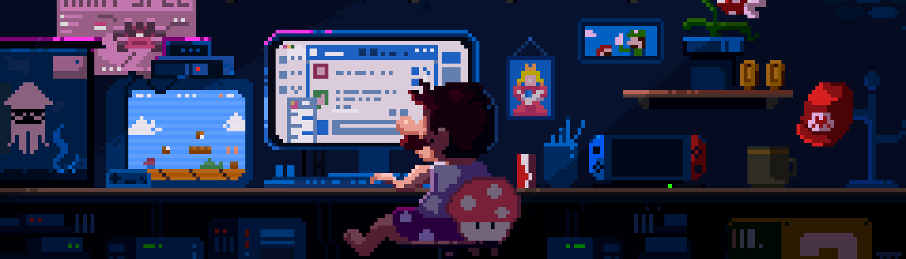

# 👽 About Me

Hi there! I'm **Sourav Goyal**, a Computer Science student and a dedicated **Full-Stack Web Developer** with a growing passion for **Artificial Intelligence**. 🚀 I specialize in building dynamic, user-centric websites and crafting robust backend systems using technologies like **Next.js**, **TypeScript**, **PostgreSQL**, and **Hono.js**. 🌟 My journey is now expanding into the fascinating world of **AI and Machine Learning**, where I’m exploring ways to integrate intelligent solutions into web applications. For me, coding is not just about problem-solving—it’s about creating innovative tools that make an impact. 💡

## 🚀 Current Focus

🎯 Currently, I’m diving into **AI/ML** alongside my web development projects, experimenting with frameworks like **PyTorch** and **LangChain** to create smart, interactive applications. On the web development side, I am refining my expertise in advanced backend optimizations, server-side rendering with **Next.js**, and API design with **PostgreSQL**. My goal is to merge the power of AI with traditional development to create innovative applications that solve real-world challenges. 🌐

## 🤝 Collaboration Opportunities

💬 I am always eager to collaborate on projects that blend web development with AI, such as building intelligent automation tools, integrating machine learning models into full-stack applications, or exploring innovative AI-powered solutions. I’m also interested in contributing to open-source initiatives and working with others on groundbreaking ideas. If you share a similar passion for **AI** and **web development**, let’s team up and create something extraordinary! 🚀

## 📚 Continuous Learning

📖 My learning journey is currently focused on mastering **AI and Machine Learning**, exploring concepts like deep learning, natural language processing, and model integration into web applications. At the same time, I’m deepening my knowledge of **server-side rendering**, **scalable system design**, and advanced **state management** in web development. By combining these fields, I aim to create web solutions that are both intelligent and impactful. 🌟

## 🎮 Outside the Code

🎲 Beyond coding, I enjoy gaming, watching movies or series, and staying up-to-date with the latest tech trends. My creative downtime fuels my curiosity and helps me think outside the box when tackling complex challenges. With every project, I strive to bridge creativity, technology, and intelligence to deliver meaningful solutions. 🌈

## 🌐 Socials:

  

## 💻 Tech Stack:

## 📊 GitHub Stats:

  
  
  

### ✍️ Random Dev Quote

### 🔝 Top Contributed Repo

## 💰 You can help me by Donating

